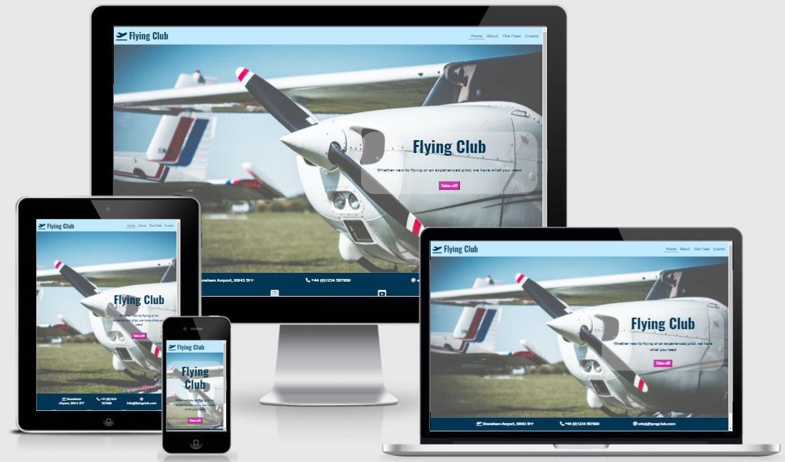
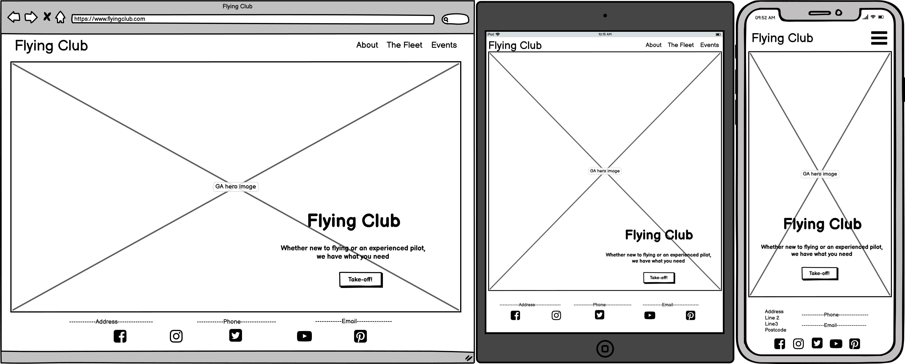
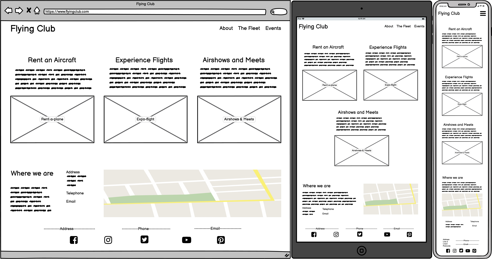
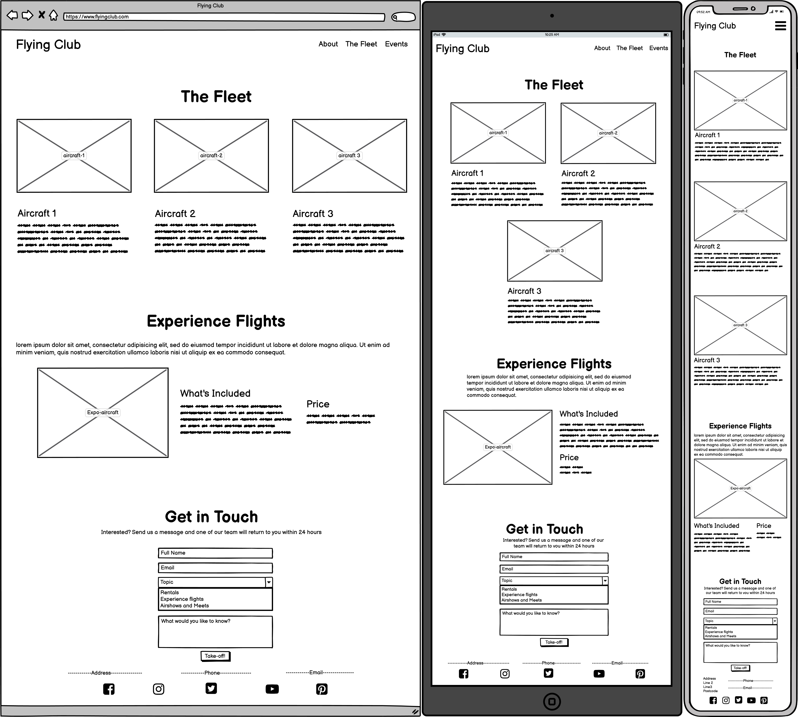
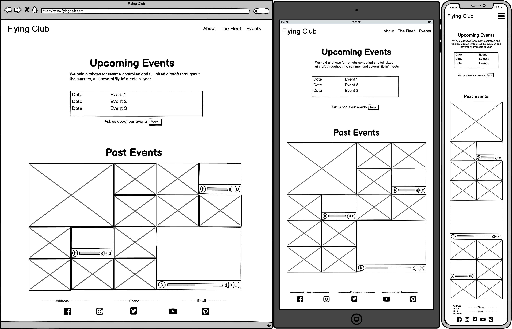
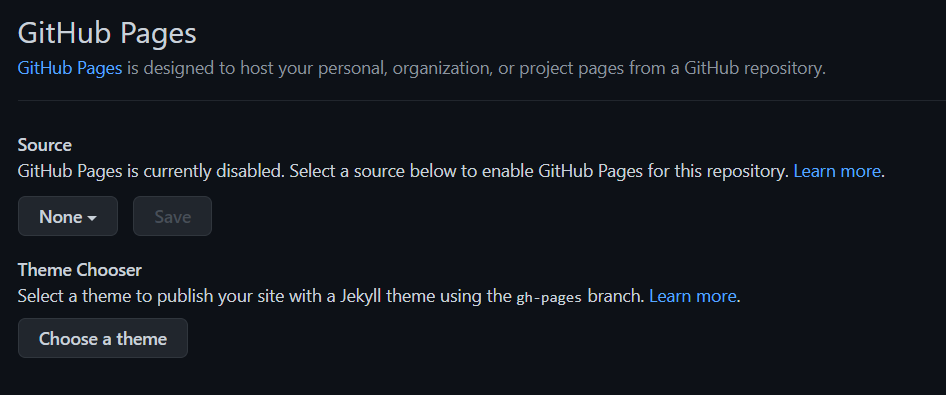
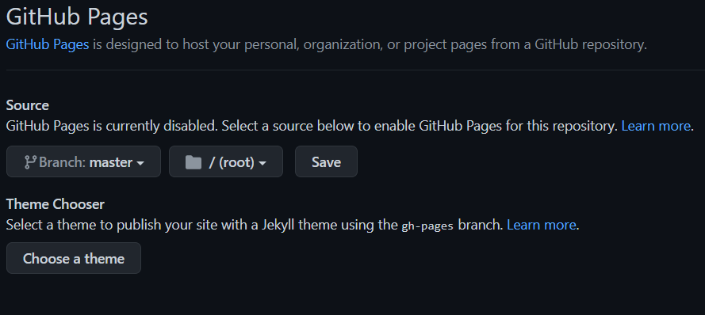

# Flying Club

Flying club is a PPL (Private Pilot's Licence) flying club, with a selection of aircraft to rent and a full calendar of events. A link to the active page is [here](https://tealhorizon87.github.io/ms1_flying-club/).

## Table of Contents
1. [UX](#ux)
    - [User Stories](#user-stories)
    - [Design](#design)
    - [Wireframes](#wireframes)
2. [Features](#features)
3. [Technologies Used](#technologies-used)
4. [Testing](#testing)
5. [Deployment](#deployment)
6. [Credits](#credits)
    - [Content](#content)
    - [Media](#media)
    - [Acknowledgements](#acknowledgements)

## UX
This is the main website for Flying Club, a general aviation flying club that organises air-shows and 'fly-in' events, allows pilots to rent aircraft, and offers experience flights to new users.

### User Stories
#### Common user stories (pilots and first-timers)
- As a user, I expect -
    - to be able to easily navigate around the site.
    - to be able to view the site from any device size.
- As a user, I want
    - to be able to see the cost of service without barriers.
    - to be able to see the location of the service.
    - to be able to  easily understand what the website does.

#### Pilot user stories
- As a user, I want
    - to see what aircraft variety there is available.
    - to see a calendar of upcoming events.

#### First-timers user stories
- As a new user, I expect to feel welcome and not intimidated by lots of technical language.
- As a new user, I want to know that the events are run by professionals.

### Design

The site is designed with four pages - index, about, fleet and events. There are links provided throughout each page to connect to other sections of the project. Each page is fully responsive, and features rearranged for smaller sized screens.

The font families used for the project are Oswald for all headings, and Lato for the main body text.

The colour palette used to generate all colours in the project was generated by [coolors](https://coolors.co/)

### Wireframes
Below are the wireframes that I created using [Balsamiq](https://balsamiq.com/)
#### Home

#### About

#### The Fleet

#### Events

## Features
- The site is fully responsive by using the [Bootstrap](https://getbootstrap.com/) framework.
- The site is easy to navigate by using the navbar in the header if each page.
- The location of the services is added by inserting [Google Maps](https://www.google.com/maps) into a frame element.
- An events list is added to the events page.

### Future Features
- Add a members page with more specific information targeted at a regular user.
- Add a login/sign up modal to access the members section.
- Add an interactive booking system that shows the availability of the aircraft.

## Technologies Used
### Languages:
  - [HTML5](https://en.wikipedia.org/wiki/HTML5)
      - This is the main mark-up language for the project.
  - [CSS3](https://en.wikipedia.org/wiki/CSS)
      - Used for personalised styling over and above the Bootstrap framework.
### Libraries and Frameworks:
  - [Bootstrap 4.6](https://getbootstrap.com/docs/4.6/getting-started/introduction/)
      - Used to provide the framework and facilitating responsiveness.
  - [Google Fonts](https://fonts.google.com/)
      - Used as the source for the font databases used in this site.
  - [Font Awesome 5.15.3](https://fontawesome.com/)
      - Used as the source for the icons used, including the social media links in the footer.
### Tools:
  - [Atom](https://atom.io/) with [GitHub Desktop](https://desktop.github.com/)
      - Atom is my preferred text editor, linked with GitHub Desktop in order to push the code to GitHub.
  - [Git](https://git-scm.com/)
      - Used for version control.
  - [GitHub](https://github.com/)
      - Used to store, host and publish the project files.
  - [Balsamiq](https://balsamiq.com/)
      - A wireframe program used to create the mock-ups.

## Testing

##Deployment
Deployment for this project is via GitHub Pages.
- From the repository home page, select the 'settings' tab
- Scroll down the menu on the left and select 'pages'
- 
From the dropdown menu under 'source', select the branch that you wish to publish (usually master or main)
- 
Make sure that the root folder is selected and click save

## Credits
### Content
  - [Bootstrap](https://getbootstrap.com/docs/4.6/getting-started/introduction/) grid system was used to make the site responsive, and various pre-coded style classes were used for layout purposes.
  - The navbar was taken from [Bootstrap](https://getbootstrap.com/docs/4.6/getting-started/introduction/) and then personally styled.
  - The image carousel was also copied from [Bootstrap](https://getbootstrap.com/docs/4.6/getting-started/introduction/) documentation.

### Media
  - The hero image on the home page was taken from [picjumbo](https://picjumbo.com/)
  - Images from the about page came from (left to right)
      - [pixabay](https://pixabay.com/photos/aircraft-a-small-plane-piper-arrow-5403046/)
      - [Wikipedia](https://en.wikipedia.org/wiki/Diamond_DA40_Diamond_Star#/media/File:DiamondDA40StarC-GSPBinstrumentpanel.jpg)
      - [pxhere](https://en.wikipedia.org/wiki/File:Piper_warrior.jpg)
  - Images from the fleet page all came from [Wikipedia](https://en.wikipedia.org)
  - Images and videos used for the events carousel were taken from [pixabay](https://pixabay.com)

### Acknowledgements
As this is my first attempt at building a webpage from scratch, special thanks go to so many for the help and advice needed to complete this project. They include, but are not limited to:
  - [w3schools](https://www.w3schools.com/default.asp) - an essential source of support for the novice coder.
  - [Stack Overflow](https://stackoverflow.com/) - much like w3schools, an essential source of guidance...there is always someone who has had the same problem, and the answer is likely here.
  - [Code Institute](https://codeinstitute.net/) - from inspiration through all the walkthrough projects to the tools needed to complete.
  - My mentor for providing help, support and feedback.
