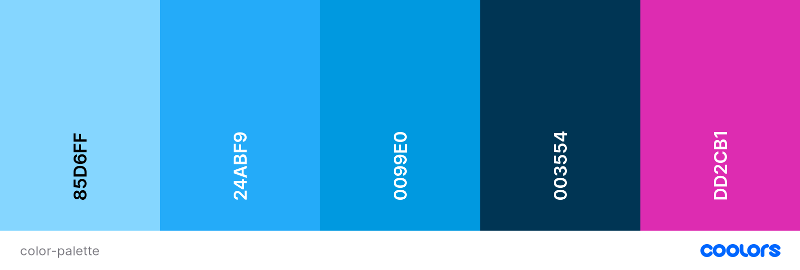
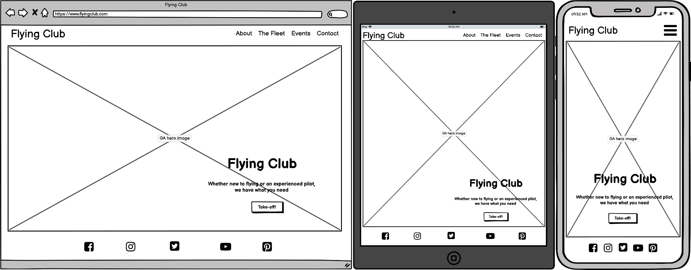
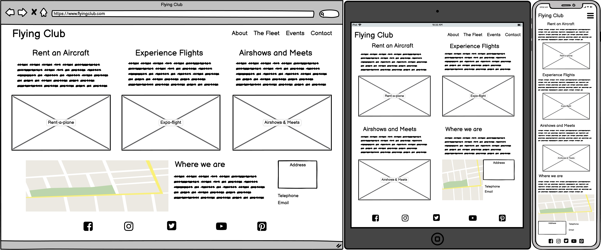
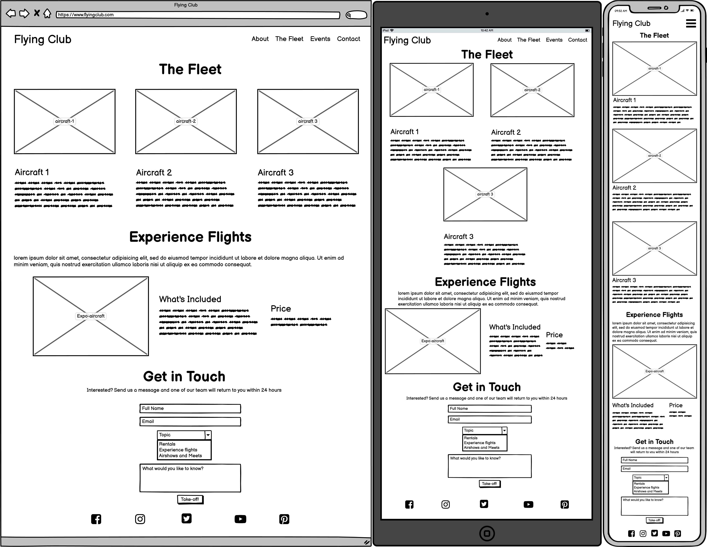
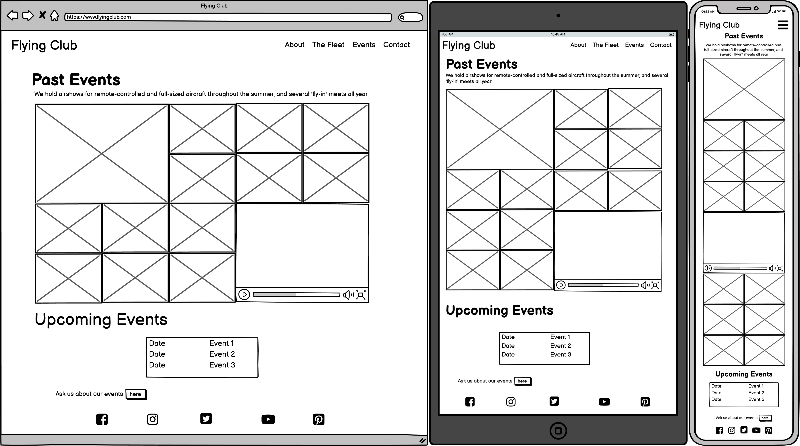

# Flying Club

Flying club is a PPL (Private Pilot's Licence) flying club, with a selection of aircraft to rent and a full calendar of events.

## Table of Contents
1. [UX](#ux)
    - [User Stories](#user-stories)
    - [Design](#design)
    - [Wireframes](#wireframes)
2. [Features](#features)
3. [Technologies Used](#technologies-used)
4. [Testing](#testing)

## UX
This is the main website for Flying Club, a general aviation flying club that organises air-shows and 'fly-in' events, allows pilots to rent aircraft, and offers experience flights to new users.

### User Stories
#### Common user stories (pilots and first-timers)
- As a user, I expect -
    - to be able to easily navigate around the site.
    - to be able to view the site from any device size.
- As a user, I want
    - to be able to see the cost of service without barriers.
    - to be able to see the location of the service.
    - to be able to  easily understand what the website does.

#### Pilot user stories
- As a user, I want
    - to see what aircraft variety there is available.
    - to see a calendar of upcoming events.

#### First-timers user stories
- As a new user, I expect to feel welcome and not intimidated by lots of technical language.
- As a new user, I want to know that the events are run by professionals.

### Design

The site is designed with four pages - index, about, fleet and events. There are links provided throughout each page to connect to other sections of the project. Each page is fully responsive, and features rearranged for smaller sized screens.

The font families used for the project are Oswald for all headings, and Lato for the main body text.

The colour palette used to generate all colours in the project was generated by [coolers](https://coolors.co/)

### Wireframes
Below are the wireframes that I created using [Balsamiq](https://balsamiq.com/)
#### Index

#### About

#### The Fleet

#### Events

## Features
- The site is fully responsive by using the [Bootstrap](https://getbootstrap.com/) framework.
- The site is easy to navigate by using the navbar in the header if each page.
- The location of the services is added by inserting [Google Maps](https://www.google.com/maps) into a frame element.
- An events list is added to the events page.

### Future Features
- Add a members page with more specific information targeted at a regular user.
- Add a login/sign up modal to access the members section.
- Add an interactive booking system that shows the availability of the aircraft.

## Technologies Used
### Languages:
  - [HTML5](https://en.wikipedia.org/wiki/HTML5)
      - This is the main mark-up language for the project.
  - [CSS3](https://en.wikipedia.org/wiki/CSS)
      - Used for personalised styling over and above the Bootstrap framework.
### Libraries and Frameworks:
  - [Bootstrap](https://getbootstrap.com/)
      - Used to provide the framework and facilitating responsiveness.
  - [Google Fonts](https://fonts.google.com/)
      - Used as the source for the font databases used in this site.
  - [Font Awesome](https://fontawesome.com/)
      - Used as the source for the icons used, including the social media links in the footer.
### Tools:
  - [Atom](https://atom.io/) with [GitHub Desktop](https://desktop.github.com/)
      - Atom is my preferred text editor, linked with GitHub Desktop in order to push the code to GitHub.
  - [Git](https://git-scm.com/)
      - Used for version control.
  - [GitHub](https://github.com/)
      - Used to store, host and publish the project files.
  - [Balsamiq](https://balsamiq.com/)
      - A wireframe program used to create the mock-ups.

## Testing
